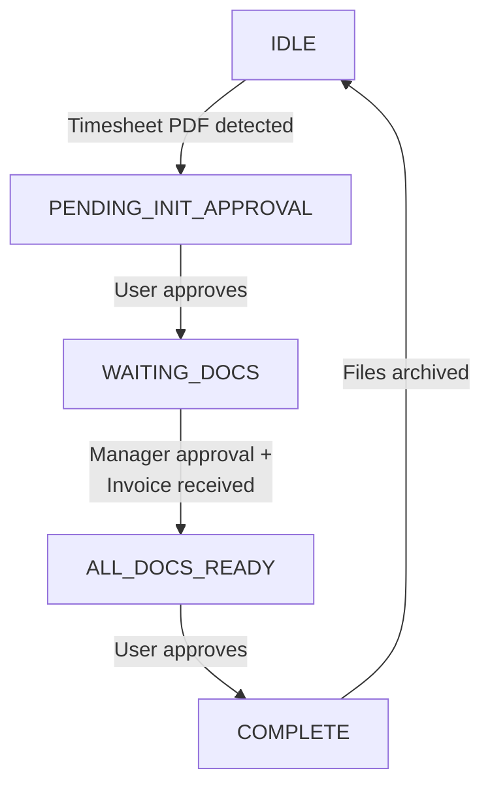

# Invoice Automation

A Python service that automates the monthly invoice workflow with Telegram approvals.

## How It Works

### Workflow Steps

1. **IDLE** → Drop a Jira timesheet PDF into the watch folder
2. **PENDING_INIT_APPROVAL** → Bot parses hours, asks for Telegram approval
3. **WAITING_DOCS** → Emails sent to manager (for approval) and accountant (for invoice)
4. **ALL_DOCS_READY** → Both responses received, asks for final Telegram approval
5. **COMPLETE** → Merges invoice + timesheet + approval email into one PDF, sends it, archives files

State is persisted to disk - the service can restart without losing progress.

---

## Telegram Bot Setup

1. Create a bot via @BotFather
2. Send a message to the bot (or add to a group)
3. Get chat ID: `https://api.telegram.org/<YOUR_BOT_TOKEN>/getUpdates`

**For group chats**: Disable privacy mode via BotFather:
- `/setprivacy` → Select your bot → Disable

This allows the bot to receive all messages (needed for the "Edit Hours" flow).

**Debug menu**: Set `TELEGRAM_DEBUG_MENU=true` in `.env` to enable test buttons.

## Google Gmail API Setup

1. Create a project in Google Cloud Console
2. Enable Gmail API for that project
3. Create OAuth 2.0 credentials (Desktop app type)
4. OAuth consent screen → Test users → Add your Gmail account
5. Download credentials.json to `config/` folder
