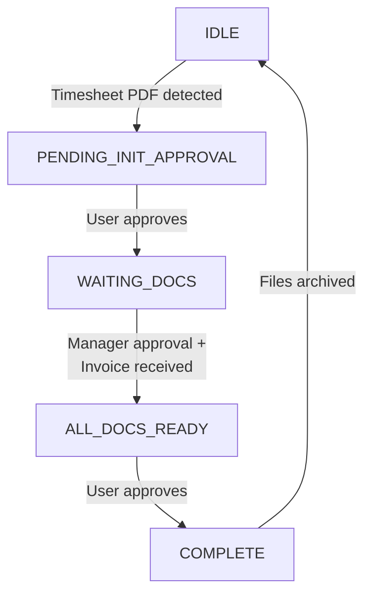

# Invoice Automation

A Python service that automates the monthly invoice workflow with Telegram approvals.

## How It Works


```mermaid
graph TD
    A[IDLE] -->|Timesheet PDF detected| B[PENDING_INIT_APPROVAL]
    B -->|User approves| C[WAITING_DOCS]
    C -->|Manager approval +<br>Invoice received| D[ALL_DOCS_READY]
    D -->|User approves| E[COMPLETE]
    E -->|Files archived| A
```

### Workflow Steps

**1. IDLE** - Folder watcher monitors for new PDF files in the watch folder.

**2. PENDING_INIT_APPROVAL** - A new timesheet PDF is detected. The bot parses it with pdfplumber to extract total hours and date range, calculates the invoice amount (hours x hourly rate), and sends a Telegram message with Approve / Edit Hours / Cancel buttons. User can edit the hours before approving.

**3. WAITING_DOCS** - User approved. Two emails are sent:
- To **manager** (cc: invoicing dept) with the timesheet PDF attached, requesting approval
- To **accountant** with total hours and line-item breakdown, so they can generate the official invoice

The Gmail monitor polls the inbox and tracks both email threads by thread ID. Two flags are tracked independently:
- `approval_received` - set when manager replies to their thread. Detection: keyword match against configurable `APPROVAL_KEYWORDS`, with LLM fallback for ambiguous replies.
- `invoice_received` - set when accountant replies with a PDF attachment to their thread.

Both can arrive in any order. A 7-day reminder is sent if either is missing, then daily reminders after 14 days.

**4. ALL_DOCS_READY** - Both flags are true. The bot sends a final Telegram approval with Approve / Cancel buttons.

**5. COMPLETE** - User approved. Three PDFs are merged in order: invoice (from accountant) + timesheet (from Jira) + approval email (converted to PDF via Playwright). The merged PDF is sent as a reply to the manager's email thread. All files are archived to `{archive_folder}/{year}-{month}/`.

The workflow then resets to IDLE automatically. Cancelling at any approval step archives files to a `cancelled/` subfolder and resets.

State is persisted to `data/state.json` - the service can restart without losing progress. On startup, it recovers the current state and re-sends any pending Telegram approval messages.

---

## Telegram Bot Setup

1. Create a bot via @BotFather
2. Send a message to the bot (or add to a group)
3. Get chat ID: `https://api.telegram.org/<YOUR_BOT_TOKEN>/getUpdates`

**For group chats**: Disable privacy mode via BotFather:
- `/setprivacy` → Select your bot → Disable

This allows the bot to receive all messages (needed for the "Edit Hours" flow).

**Debug menu**: Set `TELEGRAM_DEBUG_MENU=true` in `.env` to enable test buttons.

## LLM Configuration

The service uses an LLM to classify ambiguous email replies (approval detection). Two providers are supported:

**Ollama (default)** — any OpenAI-compatible API:
```env
LLM_PROVIDER=openai
LLM_MODEL=qwen2.5:3b
LLM_BASE_URL=https://your-ollama-host/v1
LLM_API_KEY=ollama  # Ollama ignores this, but the OpenAI client requires a value
```

**Google Gemini:**
```env
LLM_PROVIDER=gemini
LLM_MODEL=gemini-2.0-flash-lite
GEMINI_API_KEY=AIzaSy...
```

Any OpenAI-compatible API works with the `openai` provider (Ollama, LM Studio, vLLM, OpenAI itself, etc.). The `LLM_BASE_URL` should point to the `/v1` endpoint.

## Google Gmail API Setup

1. Create a project in Google Cloud Console
2. Enable Gmail API for that project
3. Create OAuth 2.0 credentials (Desktop app type)
4. OAuth consent screen → Test users → Add your Gmail account
5. Download credentials.json to `config/` folder
